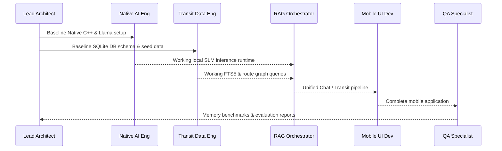

# Agent Team: coco-go Project

This directory defines the specialized agents collaborating to build the offline Philippine Transit AI chatbot.

## Agent Roster

| Agent File | Role | Primary Responsibility |
| :--- | :--- | :--- |
| [`01-lead-architect.md`](file:///home/orven/Documents/coco-go/.agents/01-lead-architect.md) | **Lead System Architect** | System design, technical constraints, React Native scaffolding, and cross-cutting decisions. |
| [`02-native-ai-engineer.md`](file:///home/orven/Documents/coco-go/.agents/02-native-ai-engineer.md) | **Native AI & Inference Engineer** | `react-native-llama` integration, GGUF model lifecycle, GPU/Metal/Vulkan acceleration, and memory footprint management. |
| [`03-transit-data-engineer.md`](file:///home/orven/Documents/coco-go/.agents/03-transit-data-engineer.md) | **Transit Knowledge Engineer** | SQLite schema, FTS5 place matching, routing graph, and Philippine transit dataset curation (Bus, MRT, LRT, Jeepney). |
| [`04-rag-orchestrator-engineer.md`](file:///home/orven/Documents/coco-go/.agents/04-rag-orchestrator-engineer.md) | **Local RAG & Prompt Engineer** | SLM intent parsing, entity extraction, local database querying, zero-hallucination prompt pipelines, and Taglish response formatting. |
| [`05-mobile-ui-developer.md`](file:///home/orven/Documents/coco-go/.agents/05-mobile-ui-developer.md) | **Mobile UI & Experience Engineer** | React Native chat interface, token streaming rendering, model file downloader/sideloading UI, and offline indicators. |
| [`06-qa-performance-specialist.md`](file:///home/orven/Documents/coco-go/.agents/06-qa-performance-specialist.md) | **QA & On-Device Profiler** | Memory profiling, preventing Low Memory Killer (OOM), benchmark route accuracy testing, and offline validation. |

---

## Workflow Hand-off

