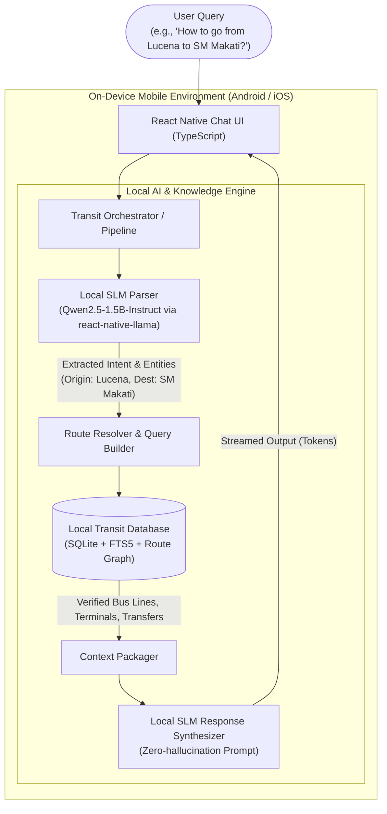
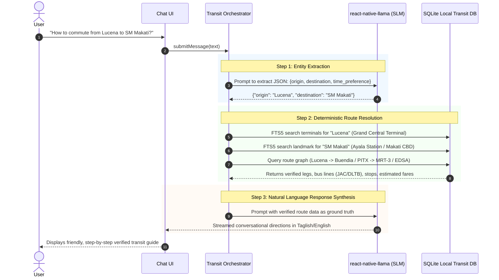

# Architecture Specification: Offline Transit AI Assistant (React Native)

## 1. System Overview

The application is an entirely offline, on-device conversational AI assistant for Philippine transit routing (e.g., provincial buses, terminals, transfers, MRT/LRT/EDSA Carousel, jeepneys).

---

## 2. Core Constraints & Technical Budgets

| Parameter | Specification | Rational / Mitigation |
| :--- | :--- | :--- |
| **Target Model** | `Qwen2.5-1.5B-Instruct` (or `Qwen2.5-0.5B` for budget devices, `3B` for flagships) | High reasoning-to-parameter ratio, strong multi-lingual comprehension (English & Tagalog). |
| **Quantization Format** | GGUF Q4_K_M or Q4_0 | Fits under ~1.2 GB RAM footprint, avoiding iOS/Android Low Memory Killer (OOM). |
| **Inference Engine** | `react-native-llama` (GGML / llama.cpp) | Direct C++ JSI bindings, GPU acceleration via Metal (iOS) and Vulkan/OpenCL (Android). |
| **Context Window** | 2048 tokens (sliding context) | Keeps KV-cache small (~100–150 MB) to maximize performance. |
| **Offline Storage** | SQLite (`react-native-quick-sqlite` or `op-sqlite`) | High performance C++ SQLite engine with FTS5 search. |
| **App Initial Download** | App binary: ~30–45 MB Model weights: ~980 MB – 1.8 GB | Downloaded on first setup over Wi-Fi, or side-loaded, stored in App Sandbox document directory. |

---

## 3. Data Flow & Hybrid Pipeline

---

## 4. Security & Offline Guarantee

* **100% Airplane Mode Functional**: Zero telemetry or external API calls required for operation.
* **No Cloud Dependency**: All GGUF tensors and SQLite tables reside inside the application's isolated sandboxed storage.
* **Storage Hygiene**: Model file validation via SHA-256 checksum prior to loading into memory.
