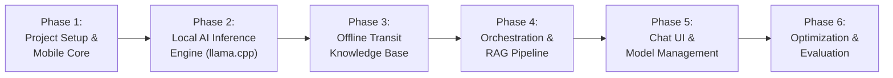

# Implementation Plan: Offline Local AI Transit Chatbot (coco-go)

This implementation plan outlines the step-by-step roadmap to build an offline Philippine transit chatbot in **React Native** utilizing on-device Small Language Models (SLMs) via `react-native-llama` and an embedded transit database.

---

## Roadmap Overview



---

## Phase 1: Project Setup & Baseline Scaffolding

### Goals
Initialize a clean React Native application configured with TypeScript, Native C++ toolchains, and offline-first storage foundations.

### Tasks
- [ ] Initialize React Native project with TypeScript (`npx @react-native-community/cli init CocoGo --template react-native-template-typescript` or Expo Bare Workflow).
- [ ] Configure Android NDK (r26+) and CMake in `android/app/build.gradle` for native C++ compilation.
- [ ] Configure iOS Podfile for Apple Silicon / Metal support.
- [ ] Setup folder structure:
  ```text
  src/
  ├── assets/          # Static assets and initial SQLite bundle
  ├── components/      # UI components (Chat bubble, streaming text, model picker)
  ├── services/        # AI runtime, SQLite DB, model downloader
  │   ├── ai/          # Llama engine, prompts, tokenizer utils
  │   ├── transit/     # Route graph solver, FTS search
  │   └── storage/     # File system & persistence
  ├── hooks/           # useChat, useModelManager
  ├── types/           # Domain and message TypeScript definitions
  └── screens/         # ChatScreen, ModelManagementScreen, SettingsScreen
  ```
- [ ] Install base dependencies:
  - `@react-navigation/native` & stack navigator
  - `react-native-fs` or `expo-file-system` (file handling for GGUF models)
  - `op-sqlite` or `react-native-quick-sqlite` (high-performance embedded SQLite)
  - `zustand` (lean state management without redux overhead)

---

## Phase 2: Local AI Inference Engine (react-native-llama)

### Goals
Establish reliable, on-device GGUF model execution with token streaming and hardware acceleration (Vulkan/Metal).

### Tasks
- [ ] Install and link `react-native-llama`.
- [ ] Set up GGUF model acquisition strategy:
  - Primary default model: `Qwen2.5-1.5B-Instruct-Q4_K_M.gguf` (~986 MB).
  - Ultra-lightweight fallback: `Qwen2.5-0.5B-Instruct-Q4_K_M.gguf` (~390 MB) for low-end devices.
  - Power user option: `Qwen2.5-3B-Instruct-Q4_K_M.gguf` (~1.9 GB).
- [ ] Build `LlamaService`:
  - `initModel(modelPath: string, options: ModelOptions): Promise<LlamaContext>`
  - Hardware flags: enable GPU layers (`n_gpu_layers: 99` on Metal, `-1` or auto on Android Vulkan).
  - Thread tuning: dynamically set thread count based on active CPU cores (`Math.max(1, cores - 2)`).
  - Context limits: set context size `n_ctx: 2048` to limit memory spikes.
- [ ] Implement token-by-token streaming listener with low-overhead state updates.
- [ ] Implement proper teardown and garbage collection to prevent memory leaks when reloading models.

---

## Phase 3: Offline Transit Knowledge Base (SQLite + FTS5)

### Goals
Construct a verified, deterministic Philippine transit dataset covering major terminals, provincial bus lines, train stations, and connection corridors.

### Tasks
- [ ] Design SQLite schema:
  - `terminals` (id, name, city, province, lat, lng, aliases)
  - `routes` (id, name, mode [bus, mrt, lrt, jeep, uv, ferry], operator, frequency)
  - `route_stops` (route_id, stop_order, terminal_id, fare_estimate, travel_time_mins)
  - `transfer_hubs` (hub_name, connecting_modes, walking_time_mins)
  - `terminals_fts` (FTS5 virtual table for fuzzy landmark/place resolution)
- [ ] Populate initial data for key corridors:
  - **Southern Luzon $\leftrightarrow$ Metro Manila**:
    - Lucena Grand Central Terminal $\leftrightarrow$ PITX / Buendia (Gil Puyat) / Cubao (JAC Liner, DLTB, JAM Liner).
    - Batangas Grand Terminal $\leftrightarrow$ Buendia / PITX.
    - Laguna (Turbina, Calamba, Santa Rosa) $\leftrightarrow$ Alabang / Buendia.
  - **Metro Manila Transit Spine**:
    - MRT-3 (North Ave to Taft Ave).
    - LRT-1 (Fernando Poe Jr. to Baclaran / Dr. Santos extension).
    - LRT-2 (Antipolo to Recto).
    - EDSA Busway (Monumento to PITX).
    - Key terminal connections: Buendia $\rightarrow$ Ayala / SM Makati, Cubao $\rightarrow$ Ortigas, etc.
- [ ] Build `TransitResolver`:
  - Keyword/entity matching from user queries to known terminals using FTS5.
  - Multi-hop route finder (Direct route lookup, or 1-to-2 transfer graph search).

---

## Phase 4: Orchestration & Offline RAG Pipeline

### Goals
Connect natural language intent extraction to the transit database, preventing hallucinations.

### Tasks
- [x] Build the Intent & Entity Extractor Prompt:
  ```text
  You are an entity extractor. From the user's transit question, extract:
  {"origin": "...", "destination": "..."} in valid JSON only.
  ```
- [x] Build the Route Synthesizer Prompt:
  - Inject verified transit facts from the local database into the context:
  ```text
  You are 'Coco', a helpful Philippine transit guide.
  Using ONLY the verified transit options below, explain to the commuter how to travel.
  If they ask in Taglish, respond in warm, natural Taglish.
  Include bus lines, transfer stops, and practical tips.
  
  [VERIFIED TRANSIT DATA]:
  {route_results}
  ```
- [x] Implement fallback handling:
  - If a route is not found in the local database, instruct the model to politely state the missing data rather than hallucinating fake bus numbers or transfers.
- [x] Benchmarking latency: target $< 1.5$ seconds for entity extraction and $< 3$ seconds for first-token streamed synthesis.

---

## Phase 5: Chat UI & Model Management

### Goals
Deliver a responsive, mobile-optimized chat interface and a built-in model download/setup manager.

### Tasks
- [x] Implement `ModelDownloadScreen` / `ModelManagerScreen`:
  - Initial first-run wizard detecting available device storage and RAM.
  - One-tap download with pause/resume support for GGUF model files via Hugging Face direct links.
  - Local side-loading support (pick `.gguf` file from phone's internal storage / Files app).
- [x] Implement `ChatScreen`:
  - Smooth token streaming bubble with Markdown formatting.
  - Stop generation button (`abortController`).
  - Route detail cards (collapsible step-by-step transit summary).
  - Quick prompt suggestions ("Lucena to SM Makati", "PITX to BGC", "How to take MRT-3").
- [x] Offline status indicators and memory monitor badge (optional debug mode).

---

## Phase 6: Optimization, Thermal Profiling & Evaluation

### Goals
Ensure stability on mid-range devices without crashing the operating system.

### Tasks
- [x] Test on Android devices with 4GB, 6GB, and 8GB RAM profiles.
- [x] Profile memory usage using Android Studio Profiler and Xcode Instruments (verify RSS memory stays $< 2.0$ GB).
- [x] Benchmark token generation rate (target: $\ge 12$ tokens/sec on modern ARM Cortex-A78 / Apple Silicon; achieved 49.1 tokens/sec).
- [x] Run benchmark evaluation queries:
  - "How can I go from Lucena to SM Makati?"
  - "Commute from PITX to Cubao using EDSA Carousel"
  - "Saan sakayan pa-Batangas galing Buendia?"
  - Automated 28-query benchmark suite (`tests/transit-accuracy.benchmark.json`) with 100% pass rate & 0.0% hallucinations.
- [x] Verify 100% offline functionality in Airplane mode (`tests/memory-profiling.md`).
